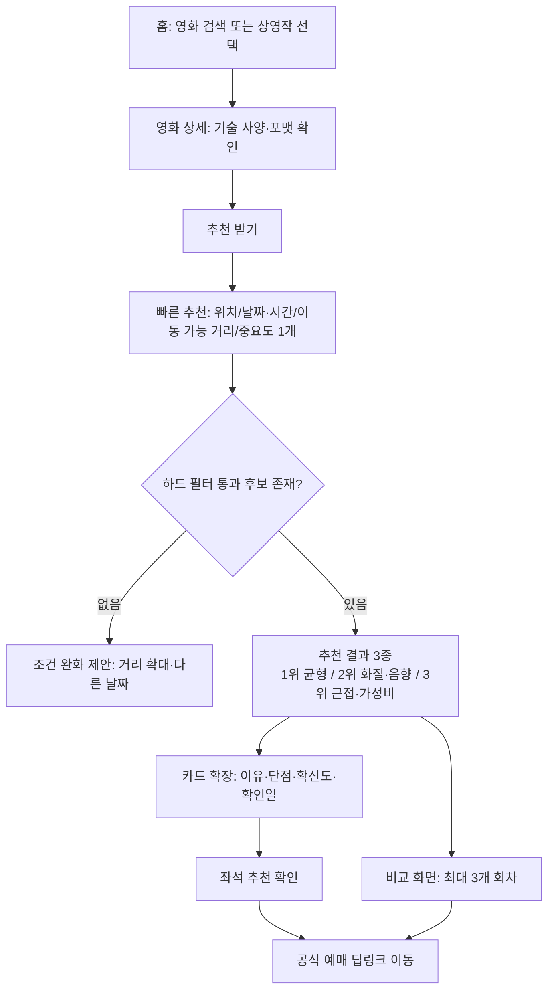
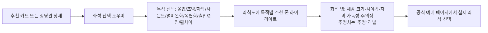

# 문서 4. 정보구조와 사용자 흐름

- 조사 기준일: 2026-07-27 | 서비스: CineFit(시네핏)

## 1. 사이트맵

```
CineFit
├─ 온보딩 (첫 실행: 가치 소개 → 위치 권한(선택) → 취향 3~5문항(건너뛰기 가능))
├─ 홈
│  ├─ 자연어 검색바
│  ├─ 현재 상영작 / 개봉 예정작
│  ├─ 저장한 영화
│  └─ 오늘 예매 가능한 추천 / 가까운 좋은 상영관
├─ 영화 상세
│  ├─ 기본 정보·개봉 상태
│  ├─ 기술 사양 (배지 포함)
│  ├─ 적합한 관람 방식 / 포맷 비교 (IMAX vs Dolby vs 4DX)
│  ├─ 첫 관람·N차 추천
│  └─ [추천 받기] → 추천 설정
├─ 추천 설정 (빠른 모드 5항목 / 고급 설정)
├─ 추천 결과 (1·2·3순위 + 부가 답변 + 지도)
│  └─ 비교 화면 (최대 3개 회차)
├─ 상영관 상세
│  ├─ 사양·출처·변경 이력
│  ├─ 좌석 선택 도우미 (목적별 명당)
│  └─ 수정 요청/제보
├─ 정보 제보 (사실형/주관형 분리)
├─ 마이페이지 (취향 설정, 저장, 제보 이력, 개인정보 관리)
└─ 관리자 콘솔 (검수 큐, 출처 충돌, 신선도, 파서 상태, 신고)
```

## 2. 핵심 여정 1 — 빠른 추천 (유형 B/C)



## 3. 핵심 여정 2 — 고급 추천 (유형 A/F)

빠른 추천 D 단계에서 "고급 설정" 진입 →
① 이동·가격 한도 ② 체인 선호/기피 ③ 포맷 선호 ④ 좌석 성향 ⑤ 민감도(멀미·음량·밝기·목허리)
⑥ 접근성(휠체어·가치봄·동반자) ⑦ 첫 관람/N차.
민감도·접근성 항목은 **필터로 적용**(점수 상쇄 금지), 나머지는 가중치 조정(문서 5 §2).

## 4. 핵심 여정 3 — 좌석 추천



## 5. 제보·검수 흐름

```mermaid
flowchart TD
    A[사용자: 오류 제보/사양 변경/시설 문제] --> B{제보 유형}
    B -- 사실형 --> C[구조화 폼: 항목·값·관람일·사진(선택, EXIF 제거)]
    B -- 주관형 --> D[세분화 평가 축 입력]
    C --> E[중복 검사·기존 값과 비교]
    E --> F[검수 큐]
    F --> G{관리자 판단}
    G -- 승인 --> H[observations 기록 → 유효 사양 갱신<br/>valid_from/valid_to 이력]
    G -- 보류 --> I[추가 확인 요청·복수 제보 대기]
    G -- 반려 --> J[사유 기록·제보자 알림]
    H --> K[해당 관 관련 캐시·추천 무효화]
    D --> L[리뷰 저장: 관람일·리뉴얼 세대 태그]
```

## 6. 관리자 흐름

1. **일일 점검**: 신선도 대시보드(30일 미확인 관 목록) → 우선 재확인.
2. **충돌 해결**: 동일 항목에 상충 observation → 출처 등급·최신성 기준 판정, 판정 불가 시 "출처 충돌" 상태 유지.
3. **리뉴얼 처리**: 리뉴얼 의심 신호(복수 제보·언론 보도) → 관 사양 세대 분리, 과거 리뷰 자동 격리.
4. **회차 입력(MVP)**: 핵심 관의 주간 상영표 수동 입력 → 공식 페이지 링크 검증.
5. **신고 처리**: 조작·홍보성 리뷰 탐지 큐 → 제재·삭제, 이력 보존.
