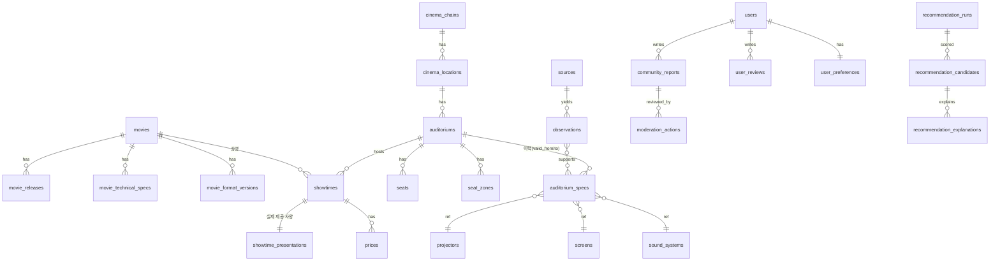

# 문서 6. 데이터 설계

- 조사 기준일: 2026-07-27 | 서비스: CineFit(시네핏) | 패키지: `@cinefit/database`
- DBMS: PostgreSQL 16 + PostGIS (선정 근거는 문서 8 ADR-3)

## 1. 설계 원칙

1. **관측과 사실의 분리**: 외부에서 들어온 모든 정보는 `observations`(불변 로그)로 먼저 기록하고,
   검수를 거쳐 `*_specs` 유효 레코드로 승격한다. 사양 테이블을 직접 덮어쓰지 않는다.
2. **유효 기간 이력**: 변할 수 있는 사양은 `valid_from`/`valid_to`(반개구간, `valid_to IS NULL`=현재)로 관리.
   리뉴얼 = 기존 레코드 `valid_to` 마감 + 새 레코드 생성. 과거 리뷰는 관측 시점으로 세대 매칭.
3. **모든 사실 필드에 신뢰도 메타**: `source_id`, `info_status`(공식확인~출처충돌 8단계 enum),
   `observed_at`, `verified_at`, `confidence(0~1)`.
4. **개인정보 분리**: `users` PII는 별도 스키마(`auth`), 서비스 스키마는 `user_id` 참조만. 위치는 지역 코드로 축소 저장.

공통 enum:
```sql
CREATE TYPE info_status AS ENUM ('official','multi_source','user_report','single_unverified',
                                 'estimated','rumor','outdated','conflict');
CREATE TYPE release_status AS ENUM ('in_production','upcoming','press_screened','partial_release',
                                    'domestic_release','ended','rerelease_upcoming','rerelease_showing');
```

## 2. ERD (핵심 관계)



## 3. 테이블 정의 (주요 필드·타입·인덱스)

### 3.1 영화 도메인

**movies** — `id uuid PK`, `title text`, `original_title text`, `runtime_min int`, `rating text`,
`genres text[]`, `director text`, `cinematographer text`, `distributor text`,
`aliases_cached text[]`, `created_at/updated_at`.
IX: `GIN(to_tsvector(title))`, `GIN(aliases_cached)`.

**movie_releases** — `movie_id FK`, `country char(2)`, `status release_status`, `release_date date`,
`rerelease_of uuid NULL`, `master_note text`(재개봉판 마스터 차이), 메타(source_id, info_status…).
UQ`(movie_id, country, release_date)`.

**movie_technical_specs** — 항목-값 세로형(EAV 변형)으로 저장해 항목별 신뢰도 부여:
`movie_id FK`, `spec_key text`(native_ar, imax_expanded_ar, imax_expansion_scenes, camera, film_format,
di_resolution, hdr, dolby_vision, hfr_fps, atmos_mix, imax_sound_mix, three_d_type, dark_scene_ratio…),
`value jsonb`, `interpretation jsonb NULL`(추천 엔진 해석 — 사실과 분리 저장),
`source_id FK`, `info_status`, `observed_at`, `verified_at`, `confidence numeric(3,2)`.
UQ`(movie_id, spec_key, source_id)`; 대표값 뷰는 소스 등급·최신성 우선순위로 산출.

**movie_format_versions** — 배급되는 포맷 버전: `movie_id`, `format text`(imax_143, imax_190, dolby_cinema,
4dx, screenx, ultra_4dx, imax70mm, 35mm, standard…), `confirmed info_status`, `notes`.

### 3.2 극장 도메인

**cinema_chains** — `id`, `name`, `booking_url_template text`.
**cinema_locations** — `chain_id FK`, `name`, `address`, `geom geometry(Point,4326)`, `region_code text`,
`status text`(operating/closed/uncertain — 메가박스 회생절차 대응), `transit_note`, `parking jsonb`.
IX: `GIST(geom)`, `region_code`.

**auditoriums** — `location_id FK`, `auditorium_no text`, `brand text`(imax, dolby_cinema, superplex,
screenx, 4dx, standard…), `status text`, `seat_count int`.
UQ`(location_id, auditorium_no)`.

**auditorium_specs** — **이력 테이블(핵심)**: `auditorium_id FK`, `valid_from date`, `valid_to date NULL`,
`screen_id FK NULL`, `projector_id FK NULL`, `sound_system_id FK NULL`,
`masking text`(side/top/both/none/unknown), `notes`, 메타(source_id, info_status, observed_at,
verified_at, confidence), `renewal_event text NULL`.
IX: `(auditorium_id, valid_from DESC)`; 제약: 동일 관의 기간 비중첩(EXCLUDE USING gist).

**projectors** — `maker`, `model`, `light_source text`(laser/xenon), `resolution text`(2k/4k),
`dual bool`, `imax_grade text NULL`(gt_dual_laser/cola/xt/unknown), `max_brightness_fl numeric NULL`,
`dolby_vision bool`, `hfr bool`, `film_capable text NULL`(35mm/70mm/imax15_70).
**screens** — `width_m numeric NULL`, `height_m numeric NULL`, `aspect text`, `curved bool`,
`material text`, `measurement_method text`(공식/실측제보/추정 — 수치 신뢰 구분).
**sound_systems** — `format text`(atmos/imax_12ch/7.1/5.1…), `speaker_layout jsonb`, `ceiling bool`, `notes`.

**seats** — `auditorium_id`, `row text`, `num int`, `zone_id FK NULL`, `attrs jsonb`
(wheelchair, couple, premium, aisle, rail_obstruction…). UQ`(auditorium_id,row,num)`.
**seat_zones** — `auditorium_id`, `purpose text[]`(immersive/overview/subtitle/sound/4dx_strong/
low_motion/neck_easy/exit_easy/pair/wheelchair), `row_range`, `col_range`, `rationale text`,
메타(신뢰도·출처) — "명당"은 목적별 존으로만 저장, 단일 명당 없음.

### 3.3 회차 도메인

**showtimes** — `movie_id`, `auditorium_id`, `starts_at timestamptz`, `ends_at_est timestamptz`,
`exit_at_est timestamptz`(광고 포함), `language text`(sub/dub/none), `booking_url text`,
`data_checked_at timestamptz`, `entry_method text`(manual/partner/parser), 메타.
IX: `(movie_id, starts_at)`, `(auditorium_id, starts_at)`.

**showtime_presentations** — `showtime_id FK UQ`, `format_version_id FK`(movie_format_versions),
`is_3d bool`, `hfr bool`, `special_type text NULL`(gv/singalong/gachibom/film_screening…).
→ "관에 IMAX 존재"와 "이 회차가 IMAX 버전" 분리가 이 테이블로 강제됨.

**prices** — `showtime_id`, `seat_grade text`, `price int`, `discount_note text`, `checked_at`.

### 3.4 신뢰도·수집 도메인

**sources** — `id`, `kind text`(official_api/official_site/press/partner/admin/user_report/community),
`name`, `url`, `terms_note text`, `allowed_use text`, `trust_weight numeric(3,2)`.
**source_snapshots** — `source_id`, `fetched_at`, `content_hash`, `storage_key text`(원문 스냅샷 —
저작권 고려해 사실 추출에 필요한 최소 범위), `etag/last_modified`.
**observations** — **불변 로그**: `id`, `entity_type text`, `entity_id uuid`, `field text`, `value jsonb`,
`source_id FK`, `snapshot_id FK NULL`, `reporter_user_id NULL`, `observed_at`, `info_status`,
`confidence`, `superseded_by uuid NULL`. IX: `(entity_type, entity_id, field, observed_at DESC)`.

### 3.5 커뮤니티·사용자 도메인

**community_reports** — 사실형 제보: `user_id`, `entity_type/entity_id`, `report_type text`
(spec_change/renewal/malfunction/seating/masking/accessibility), `payload jsonb`,
`visit_date date NULL`, `photo_keys text[]`(EXIF 제거 후 저장), `dedup_group uuid`,
`status text`(pending/approved/rejected/hold), `created_at`.
**user_reviews** — 주관형: `user_id`, `auditorium_id`, `showtime_id NULL`, `spec_generation date`
(당시 유효 사양의 valid_from — 리뉴얼 세대 태그), `axes jsonb`
(dialogue_clarity, spatiality, directionality, bass, max_loudness, balance, vibration, music — 각 1~5),
`comment text`, `visit_date`, `flags jsonb`(promo_suspect…).
**users** — auth 스키마: `id`, `email`, `oauth`, `created_at`, `deleted_at`(소프트 삭제→30일 후 완전 삭제).
**user_preferences** — `user_id UQ`, `explicit jsonb`(고급 설정), `learned jsonb`(행동 학습 가중치),
`sensitivity jsonb`, `accessibility jsonb`, `updated_at`.
**saved_movies** — `user_id`, `movie_id`, `note`, UQ 쌍.
**aliases** — `entity_type`, `entity_id`, `alias text`, `alias_type text`(community/official_short/
old_name/typo), `locale`, UQ`(entity_type, alias, locale)` — "용아맥"→관, "듄"→영화 매핑. IX: `GIN(trgm)`.

### 3.6 추천·운영 도메인

**recommendation_runs** — `user_id NULL`, `request jsonb`, `created_at`, `latency_ms`, `weights jsonb`.
**recommendation_candidates** — `run_id`, `showtime_id`, `scores jsonb`(11축+final), `rank int`, `picked_as text NULL`.
**recommendation_explanations** — `candidate_id`, `reasons jsonb`, `tradeoffs jsonb`, `uncertainties jsonb`,
`confidence_label text`, `cited_observation_ids uuid[]` — 설명의 모든 사실 문장은 observation 인용 필수.
**issue_reports** — 사용자 오류 신고: 대상, 사유, 상태.
**moderation_actions** — `actor_id`, `target_type/target_id`, `action`, `reason`, `created_at` (감사 로그, 불변).
**accessibility_features** / **parking_rules** — location·auditorium 단위 세부 항목-값 + 신뢰도 메타.

## 4. 대표값 산출 규칙 (충돌 해결)

동일 `(entity, field)`에 복수 observation 존재 시:
1. `verified_at` 있는 관리자 검수 값 우선.
2. 그다음 `sources.trust_weight * exp(-경과일/반감기)` 최대값.
3. 상위 2개 값이 상충하고 가중치 차이 < 0.15 → 대표값 보류, `info_status='conflict'` 배지 노출.

## 5. 샘플 레코드 (조사로 확인된 사실만 사용)

```jsonc
// auditoriums + 현재 유효 auditorium_specs (CGV 용산아이파크몰 IMAX관)
{ "auditorium": { "location": "CGV 용산아이파크몰", "no": "IMAX관", "brand": "imax" },
  "spec": { "valid_from": "2017-07-19", "valid_to": null,
    "projector": { "imax_grade": "gt_dual_laser", "resolution": "4k", "light_source": "laser" },
    "info_status": "multi_source", "observed_at": "2026-07-27",
    "source": "namu.wiki + 언론 종합", "confidence": 0.85 },
  "aliases": [{ "alias": "용아맥", "alias_type": "community" }] }

// 출처 충돌 예 (돌비시네마 스크린 크기 순위)
{ "entity": "auditorium:megabox-namyangju-dolby", "field": "screen_size_rank",
  "observations": [ {"value": "국내 최대급", "source": "namu.wiki", "confidence": 0.5},
                    {"value": "대전과 투톱", "source": "muko.kr", "confidence": 0.5} ],
  "representative": null, "info_status": "conflict" }
```

## 6. 마이그레이션·보존 정책

- 마이그레이션: 선형 버전 관리(예: Prisma/Drizzle migrate), 롤백 스크립트 필수, 배포 게이트에 dry-run.
- `observations`·`moderation_actions`는 불변(UPDATE 금지, 정정은 새 레코드 + supersede).
- `source_snapshots` 원문은 90일 보존 후 해시만 유지(저작권·저장 비용).
- 개인 위치 로그는 저장하지 않음. 검색 로그는 익명화 후 180일.
