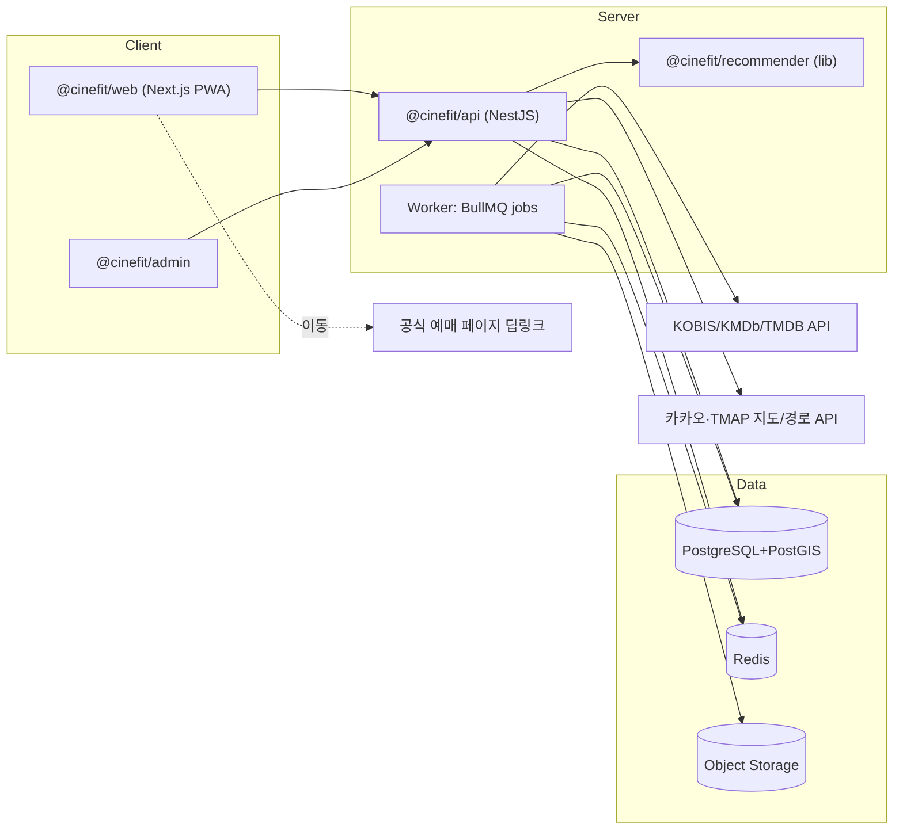

# 문서 8. 시스템 아키텍처

- 조사 기준일: 2026-07-27 | 서비스: CineFit(시네핏)

## 1. 후보 비교와 최종안

### 클라이언트
| 후보 | 평가 |
|---|---|
| **반응형 웹·PWA (선정)** | MVP 속도 최고, 스토어 심사 불필요, 딥링크·지도 무리 없음. 푸시는 웹푸시(iOS 16.4+ 지원) |
| React Native/Expo | 4단계(모바일 앱)에서 채택 예정 — 웹과 TS·로직 공유 |
| Flutter | 팀 TS 역량 가정 시 이중 언어 비용 |
| 네이티브 | MVP에 과투자 |

### 프론트/백엔드
- **Next.js 15 + TypeScript + Tailwind + Radix UI(접근성 검증 컴포넌트)** — `@cinefit/web`, `@cinefit/admin`.
- 백엔드: **NestJS(Node/TS)** `@cinefit/api` — 추천 엔진(`@cinefit/recommender`)을 동일 언어 라이브러리로 공유.
  FastAPI 대비: 언어 통일·타입 공유 이점 우선. Supabase/Firebase는 이력 모델·복잡 쿼리 제약으로 코어 DB로는 배제(인증은 Supabase Auth 옵션 검토 가능).

### 저장소·검색
- **PostgreSQL 16 + PostGIS**(공간 질의: 반경 내 상영관), **Redis**(추천 캐시·레이트리밋·잡 큐), 객체 저장소(제보 사진·스냅샷).
- 검색 엔진 비교: 데이터 규모가 작음(영화 수천, 관 수백, 회차 수만/주) →
  | 후보 | 판단 |
  |---|---|
  | **PostgreSQL FTS + pg_trgm (MVP 선정)** | 규모상 충분, 운영물 1개 감소. 한국어는 형태소 대신 trgm+별칭 테이블로 커버 |
  | Meilisearch (베타 승격 후보) | 오타 허용·즉시성 우수, 운영 단순 — 검색 UX 병목 확인 시 도입 |
  | Typesense / OpenSearch | OpenSearch는 nori 형태소 강점이나 현 규모에 과함 |

### 비동기 작업
- **BullMQ(Redis)**: 수집 배치, 뉴스 모니터링, 캐시 무효화, 알림. 재시도·중복 방지 잡 키. 관리자 승인 워크플로는 DB 상태 머신(문서 6).

### 인프라
| 후보 | 판단 |
|---|---|
| **Vercel(web) + 컨테이너 1대(api+worker, AWS Lightsail/ECS 또는 GCP Cloud Run) + Neon/RDS Postgres + Upstash Redis (MVP 선정)** | 월 ~$50–150 수준, 운영 난이도 최저. 국내 지연은 Vercel edge+서울 리전(ap-northeast-2) DB로 대응 |
| 전면 AWS(EKS 등) | 확장기 이전 과투자 |
| Cloudflare | CDN·봇 방어로 병행 사용 |

## 2. 아키텍처 다이어그램



## 3. API 구조 (요약)

```
GET  /movies?query=            # 별칭·오탈자 포함 검색
GET  /movies/:id               # 사양+정보상태 배지 포함
POST /recommendations          # RecommendationRequest → 결과 3종+부가답변
GET  /auditoriums/:id          # 사양·이력·좌석존
GET  /auditoriums/:id/seats?purpose=
POST /reports                  # 제보(사실형/주관형)
GET  /admin/queue, POST /admin/observations/:id/verify ...
인증: 이메일+OAuth(카카오·구글), JWT(수명 짧게)+refresh. 관리자 RBAC.
속도 제한: IP·계정별(Redis). 입력 검증: zod 스키마 공유(@cinefit/ui와 동일 타입).
```

## 4. 관측 가능성

- 오류: Sentry. 로그: 구조화 JSON(pino) → 수집기.
- 핵심 메트릭: 추천 p95 지연, 검색 실패율(결과 0), 파서 실패율, 데이터 신선도(30일 내 확인 비율),
  딥링크 404율, 외부 API 비용/쿼터 소진, 퍼널 이탈(추천→카드 확장→딥링크).

## 5. ADR (핵심 결정 기록)

**ADR-1. 회차를 추천의 1급 엔티티로 한다** — 상태: 채택.
맥락: "IMAX관 보유 ≠ IMAX 회차"(문서 1 §3). 결정: showtime_presentations 분리. 결과: 수동 입력 비용 증가를 감수.

**ADR-2. 상영시간표는 MVP에서 수동 입력 + 딥링크** — 상태: 채택.
맥락: 공개 API 부재, 크롤링 민사 리스크(잡코리아 판례), CGV·메가박스 봇 차단. 결정: 자동 수집 포기,
KOFIC 개방 문의·제휴 병행. 결과: 커버리지가 관리자 처리량에 종속 → MVP 범위 50~100관으로 제한.

**ADR-3. PostgreSQL 단일 저장소 + 이력 모델** — 상태: 채택.
맥락: 사양 변경·리뉴얼 추적이 제품 핵심. 결정: observations(불변) + valid_from/to 사양 이력,
검색도 MVP는 PG 내장. 결과: 별도 검색엔진 도입은 지표 기반으로 연기.

**ADR-4. LLM은 파싱·문장 정리만, 사실은 DB만** — 상태: 채택.
맥락: 사실성 요구(§26). 결정: 설명의 사실 문장은 observation 인용 필수, 미인용 문장 제거. 결과: 문서 11 §2로 회귀 검증.

**ADR-5. 추천 엔진과 수익 시스템 분리** — 상태: 채택.
결정: recommender는 광고·제휴 데이터에 접근 불가(패키지 경계), 제휴 표시는 프레젠테이션 레이어에서만.

**ADR-6. 배포: Vercel(앱) + Supabase(운영 PostgreSQL 호스팅)** — 상태: 채택(2026-07-29, 8차 마일스톤).

맥락: 7차 마일스톤에서 코드 인프라는 다 갖췄지만 실제 배포는 하지 않았다(`docs/ALPHA-PLAN.md`).
비공개 알파를 시작하려면 실제 HTTPS 배포 + 영속 PostgreSQL이 필요하다. 후보: Vercel+Supabase,
Vercel+Neon, Railway(앱+DB), Render(앱+DB).

**결정: Vercel(Next.js 앱) + Supabase(PostgreSQL 호스팅만, BaaS 클라이언트는 쓰지 않음)**.

- Next.js 호환성: Vercel은 Next.js 벤더 — 별도 설정 없이 SSR·이미지 최적화·롤백·HTTPS·환경변수
  대시보드가 즉시 동작한다.
- **주의**: 이 결정은 ADR 이전의 "Supabase/Firebase는 이력 모델·복잡 쿼리 제약으로 코어 DB로는
  배제" 판단(§1)과 충돌하지 않는다 — 그 판단은 Supabase의 **BaaS 클라이언트(PostgREST/RLS)를
  코어 데이터 접근 계층으로 쓰지 않는다**는 뜻이었고, 이번 결정은 Supabase를 **순수 관리형
  PostgreSQL 호스팅**으로만 쓴다(우리 코드는 지금처럼 `pg` 패키지로 표준 연결 문자열에 직접
  접속 — `src/data/client/postgresClient.ts`는 이미 이 방식이며 변경하지 않는다).
- 연결 풀링: Supabase가 앱 런타임용 pooled 연결(PgBouncer)과 migration용 direct 연결을
  둘 다 기본 제공한다 — `.env.example`의 `DATABASE_URL`(pooled)/`DATABASE_DIRECT_URL`(direct)
  구분이 이미 이 조합을 전제로 설계돼 있었다(우연이 아니라 원래 계획).
- 리전: Supabase는 서울(ap-northeast-2) 리전을 제공한다 — 국내 서비스에 적합.
- migration 실행: 기존 `db/migrate.mjs`가 `DATABASE_DIRECT_URL` 우선 사용을 이미 지원한다.
- HTTPS·환경변수·배포 롤백: Vercel 대시보드에서 기본 제공.
- cron: 유지보수 CLI(`maintenance:daily`/`:links`)는 그대로 Node 스크립트로 두고, Vercel Cron이
  호출할 얇은 관리자 전용 API 라우트(`/api/admin/cron/*`)로 감싼다(Railway/Render의 자체 cron보다
  Next.js 앱과 배포 단위가 같아 관리가 단순하다).
- 비용: Vercel Pro(상업적 사용에 적합, Hobby 플랜은 ToS상 비상업 용도 전제) + Supabase Pro(상시
  가동·자동 백업, 무료 티어는 일정 시간 미사용 시 일시정지돼 알파 운영에 부적합) — 문서 08 §6의
  기존 비용 추정과 같은 범주.
- 대안 기각 사유: Neon은 아시아 리전 지원이 상대적으로 제한적(서울 리전 없음, 도쿄만 최근 추가).
  Railway/Render는 자체 cron·롤백은 되지만 Next.js 특화 최적화(이미지 최적화, ISR 등)가 Vercel만큼
  성숙하지 않았고, 앱+DB를 한 플랫폼에 두는 것이 이번 규모(알파, 소수 사용자)에 필수는 아니다.

**사람이 직접 해야 하는 일** (계정 생성·결제 정보 입력은 자동화하지 않는다): Vercel/Supabase
계정 생성, 프로젝트 생성, 결제 플랜 선택, 연결 문자열 발급 후 `.env`/Vercel 환경변수에 설정 —
정확한 순서는 `docs/DEPLOYMENT.md`에 체크리스트로 정리한다.

## 6. 비용 추정(월, MVP)

Vercel Pro $20 + 컨테이너 $20–40 + Neon/RDS $19–50 + Upstash $10 + Sentry $0–26 + 지도 API(무료 쿼터 내)
≈ **$70–150/월**. 확장 시 주요 증가 요인: 지도 경로 호출량, DB IOPS, 검색엔진 추가.

## 7. 확장 계획

베타→정식: ① Meilisearch 도입(검색 지표 악화 시) ② worker 분리 스케일아웃 ③ 읽기 복제본
④ RN 앱 추가(`@cinefit/mobile`) ⑤ 제휴 피드 수신용 인제스천 서비스 ⑥ 전국 확대 시 지역 파티셔닝은 불필요(규모 작음), CDN 캐시 강화로 충분.
